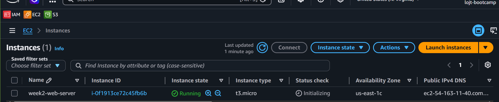
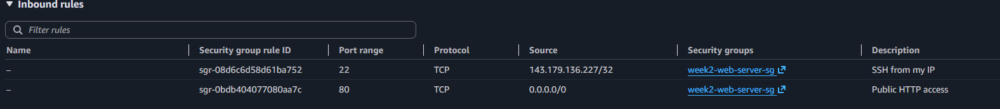
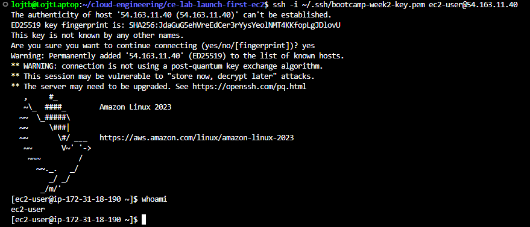
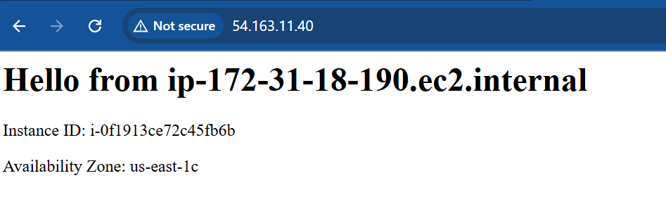

# Lab Solution
# Lab M2.01 - Launch Your First EC2 Instance

**Student Name:** Balint Lojt
**Date:** [today's date]

---

## Instance Details

**Instance ID: i-0f1913ce72c45fb6b
**Instance Type: t3.micro
**Public IP: 54.163.11.40
**Region/Availability Zone:**
us-east-1 / us-east-1c
---

## Security Group Configuration

**Security Group Name:** week2-web-server-sg

**Inbound Rules:**

my rules going here

**Outbound Rules:**

my other rules going here

## Screenshots

**1. Instance Running:**

**2. Security Group Rules:**

**3. SSH Connection:**

**4. Web Server (Browser):**

**5. Instance Details:**

---

## Challenges Faced and Solutions

When creating the security group, the "Create security group" button appeared
unresponsive - no error shown. After checking the VPC dropdown specifically,
it showed "No VPC available." Switching regions didn't resolve it. Checking
the VPC Console directly confirmed there were genuinely no VPCs in that
region (not a UI bug, and no account limit reached). Fixed by going to
VPC Console → Your VPCs → Actions → Create default VPC, which automatically
provisioned a complete default VPC setup. After that, the security group
creation worked immediately.
---

## Learning Reflections

### What surprised you most about launching a cloud server?

### How is this different from setting up a physical server or local VM?

### What security concerns did you need to consider?

### How long would this process take with traditional infrastructure?

---

## Time Tracking

- Creating key pair: ___ minutes
- Creating security group: ___ minutes
- Launching instance: ___ minutes
- Connecting via SSH: ___ minutes
- Testing and screenshots: ___ minutes
- Documentation: ___ minutes

**Total time:** ___ minutes